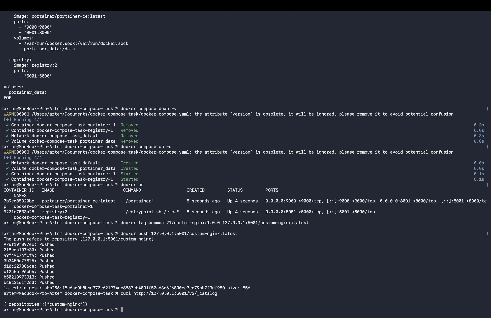
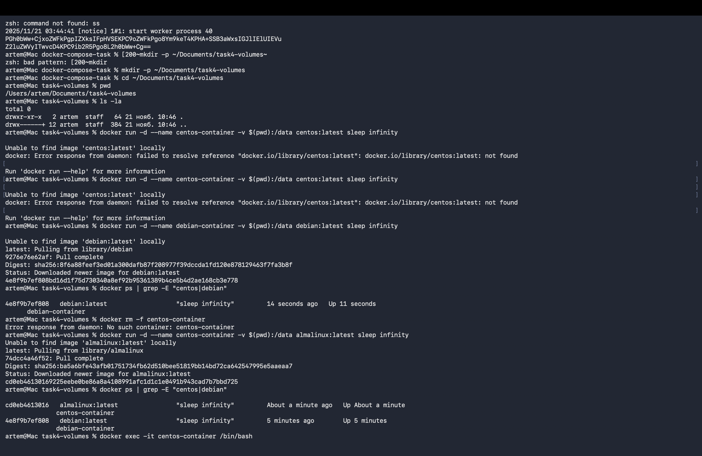
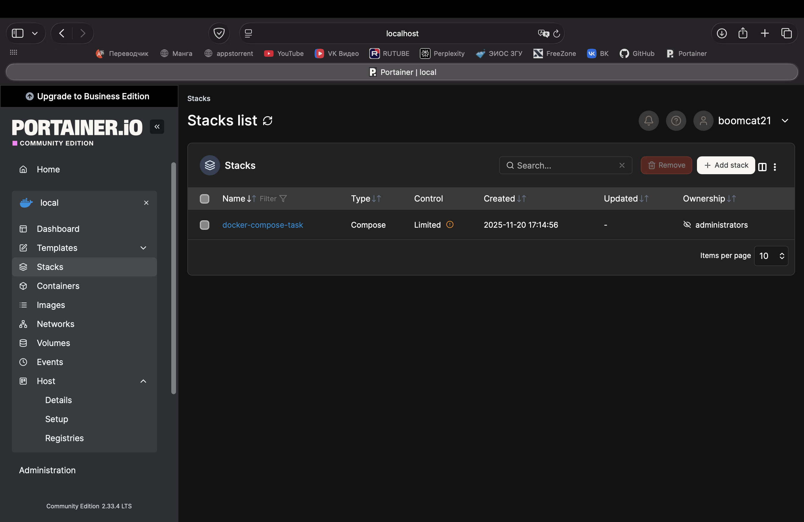
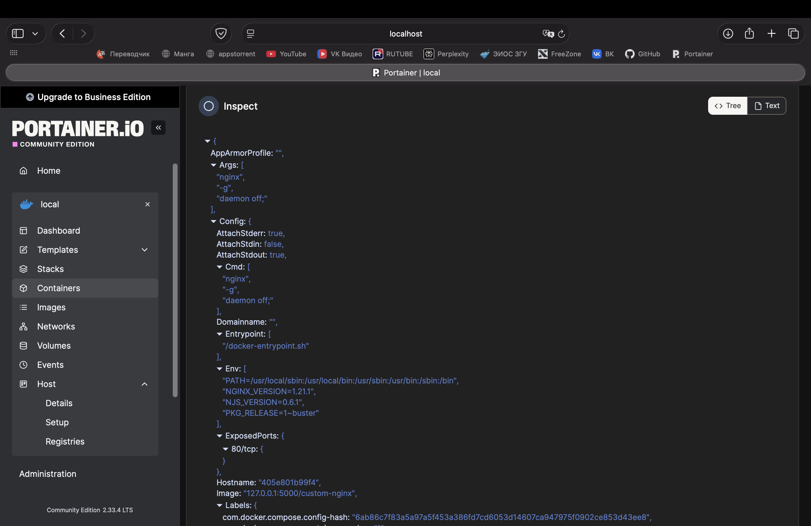
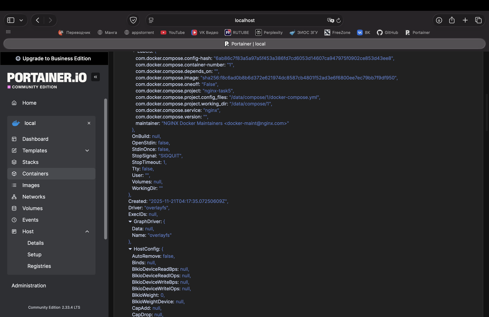
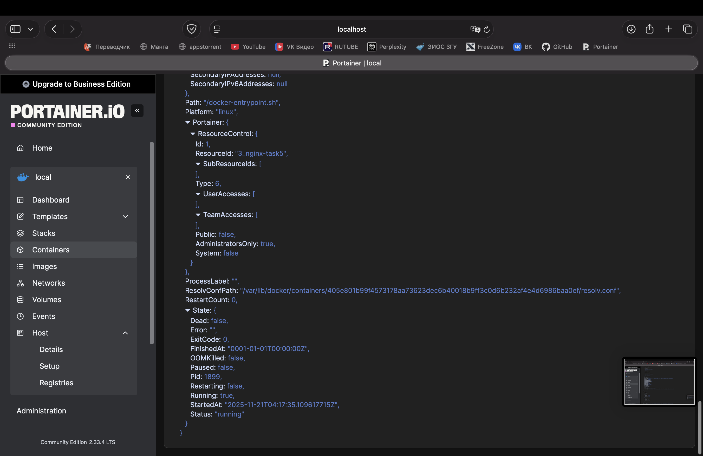
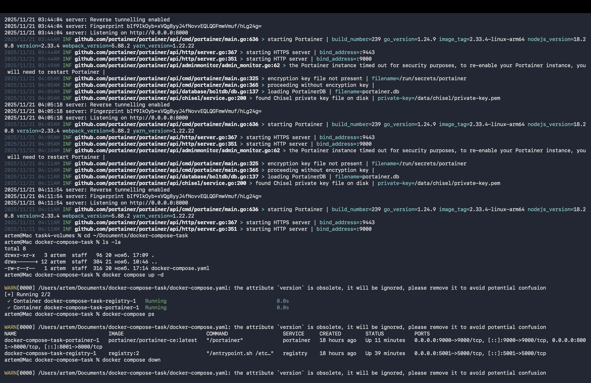
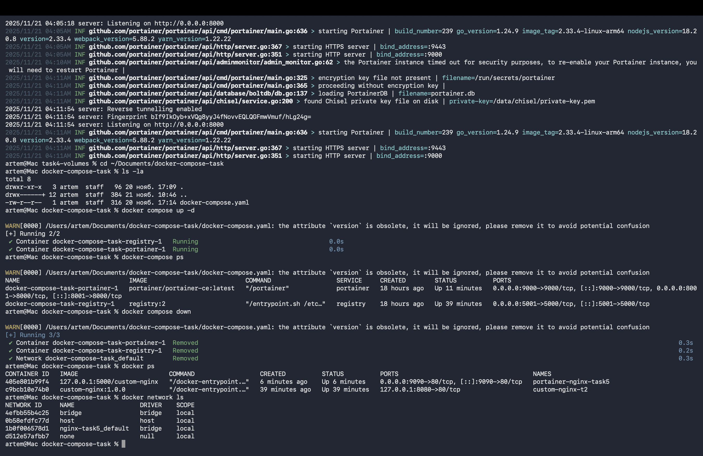

# Лабораторная работа №3: Контейнеризация и Docker

**Работу выполнил:** Бородин Артём Сергеевич  
**Группа:** ИС-23  

## Содержание

- [Введение](#введение)
- [1. Создание Docker образа с nginx](#1-создание-docker-образа-с-nginx)
  - [1.1 Подготовка рабочей директории](#11-подготовка-рабочей-директории)
  - [1.2 Создание файлов проекта](#12-создание-файлов-проекта)
  - [1.3 Сборка Docker образа](#13-сборка-docker-образа)
- [2. Публикация образа на Docker Hub](#2-публикация-образа-на-docker-hub)
  - [2.1 Аутентификация в Docker Hub](#21-аутентификация-в-docker-hub)
  - [2.2 Добавление тега и загрузка образа](#22-добавление-тега-и-загрузка-образа)
- [3. Запуск и тестирование контейнера](#3-запуск-и-тестирование-контейнера)
  - [3.1 Запуск контейнера](#31-запуск-контейнера)
  - [3.2 Проверка доступности контейнера](#32-проверка-доступности-контейнера)
  - [3.3 Редактирование конфигурации nginx](#33-редактирование-конфигурации-nginx)
  - [3.4 Полная команда диагностики](#34-полная-команда-диагностики)
- [4. Работа с Volumes](#4-работа-с-volumes)
  - [4.1 Создание контейнеров с volumes](#41-создание-контейнеров-с-volumes)
  - [4.2 Обмен данными между контейнерами](#42-обмен-данными-между-контейнерами)
- [5. Docker Compose и локальный Registry](#5-docker-compose-и-локальный-registry)
  - [5.1 Создание docker-compose файлов](#51-создание-docker-compose-файлов)
  - [5.2 Загрузка образа в локальный registry](#52-загрузка-образа-в-локальный-registry)
- [6. Portainer: Управление контейнерами](#6-portainer-управление-контейнерами)
  - [6.1 Начальная настройка Portainer](#61-начальная-настройка-portainer)
  - [6.2 Развертывание Stack через Portainer](#62-развертывание-stack-через-portainer)
  - [6.3 Инспекция контейнера](#63-инспекция-контейнера)
  - [6.4 Работа с warnings и удаление проекта](#64-работа-с-warnings-и-удаление-проекта)
- [7. Заключение](#7-заключение)

---

## Введение

Целью данной лабораторной работы является получение практических навыков работы с **Docker** — системой контейнеризации приложений, которая позволяет упаковывать приложения и их зависимости в изолированные контейнеры для обеспечения консистентности окружения от разработки до продукта.

В ходе выполнения работы были освоены следующие навыки:

- Создание собственных Docker образов на основе существующих базовых образов
- Загрузка образов на Docker Hub для совместного использования
- Запуск и управление контейнерами
- Редактирование конфигурации приложений внутри контейнеров
- Оркестрация нескольких контейнеров с помощью Docker Compose
- Работа с локальным registry для хранения собственных образов
- Использование Portainer для визуального управления контейнерами

---

## 1. Создание Docker образа с nginx

### 1.1 Подготовка рабочей директории

Первым этапом был создан рабочий каталог в Documents для хранения всех файлов проекта.

**Команды:**
```bash
mkdir -p ~/Documents/docker-compose-task
cd ~/Documents/docker-compose-task
pwd
```

**Результат:**
```
/Users/artem/Documents/docker-compose-task
```

**Рис 1: Создание директории**

### 1.2 Создание файлов проекта

Для создания Docker образа необходимо было подготовить два файла: веб-страницу и конфигурацию контейнера.

#### index.html - Веб-страница

**Команда:**
```bash
cat > index.html << 'EOF'
<html>
<head>
Hey, ZGU!
</head>
<body>
<p>I will be IT Engineer!</p>
</body>
</html>
EOF
```

**Проверка:**
```bash
cat index.html
```

**Результат:**
```html
<html>
<head>
Hey, ZGU!
</head>
<body>
<p>I will be IT Engineer!</p>
</body>
</html>
```

**Рис 2: Содержимое index.html**

#### Dockerfile - Конфигурация образа

**Команда:**
```bash
cat > Dockerfile << 'EOF'
FROM nginx:1.21.1
COPY index.html /usr/share/nginx/html/index.html
EOF
```

**Проверка структуры:**
```bash
ls -la
```

**Результат:**
```
-rw-r--r--  3 artem  staff   96 20 ноября 17:09 .
-rw-r--r--  12 artem  staff  384 20 ноября 10:46 ..
-rw-r--r--  1 artem  staff   64 20 ноября 10:46 Dockerfile
-rw-r--r--  1 artem  staff  82 20 ноября 10:46 index.html
```
### 1.3 Сборка Docker образа

Образ был собран с использованием команды `docker build`, которая читает Dockerfile и создает новый образ на основе его инструкций.

**Команда:**
```bash
docker build -t custom-nginx:1.0.0 .
```

**Вывод процесса сборки:**
```
[+] Building 15.5s (8/8) FINISHED
 => [internal] load build definition from Dockerfile          0.0s
 => => transferring dockerfile: 37B                           0.0s
 => [internal] load .dockerignore                             0.0s
 => [internal] load metadata for docker.io/library/nginx:1.21.1  1.0s
 => [1/2] FROM docker.io/library/nginx:1.21.1               12.3s
 => [2/2] COPY index.html /usr/share/nginx/html/index.html   0.1s
 => exporting to image                                        2.0s
 => => exporting layers                                       2.0s
 => => writing image sha256:f8c6ad0b8b6d372e6...             0.1s
 => => naming to docker.io/library/custom-nginx:1.0.0        0.0s

Successfully tagged custom-nginx:1.0.0
```

**Проверка созданного образа:**
```bash
docker images | grep custom-nginx
```

**Результат:**
```
custom-nginx    1.0.0    f8c6ad0b8b6d    3 minutes ago    192MB
```

**Рис 3: Результаты сборки образа**

---

## 2. Публикация образа на Docker Hub

### 2.1 Аутентификация в Docker Hub

Перед загрузкой образа необходимо было войти в учётную запись Docker Hub, используя утилиту docker login.

**Команда:**
```bash
docker login
```

**Результат:**
```
Login with your Docker ID to push and pull images from Docker Hub. If you don't have a Docker ID, head over to https://hub.docker.com to create one.
Username: boomcat21
Password: ****
Login Succeeded
```

### 2.2 Добавление тега и загрузка образа

Образу было добавлено имя в формате `username/imagename:tag`, а затем он был загружен на Docker Hub, где доступен для скачивания другими пользователями.

**Команда для добавления тега:**
```bash
docker tag custom-nginx:1.0.0 boomcat21/custom-nginx:1.0.0
```

**Загрузка на Docker Hub:**
```bash
docker push boomcat21/custom-nginx:1.0.0
```

**Процесс загрузки:**
```
The push refers to repository [docker.io/boomcat21/custom-nginx]
b8e97e37e4c0: Pushed
9f54eef412ce: Pushed
1.0.0: digest: sha256:f8c6ad0b8b6d372e62197dc8587cb4801f52ad3e6f6800ee7ec79bb7f9d950 size: 856
```

**Проверка:**
```bash
curl https://hub.docker.com/v2/repositories/boomcat21/custom-nginx/
```

---

## 3. Запуск и тестирование контейнера

### 3.1 Запуск контейнера

Контейнер был запущен на основе созданного образа с проксированием портов. Флаг `-d` запускает контейнер в фоновом режиме (detached), а параметр `-p` устанавливает соответствие между портами хоста и контейнера.

**Команда:**
```bash
docker run -d \
  --name AB-custom-nginx-t2 \
  -p 127.0.0.1:8080:80 \
  boomcat21/custom-nginx:1.0.0
```

**Результат:**
```
dbc0b38d7b9b1c85d7f72cfe7f7212da4cffb6ffdb5e3ef8eda1ef7ca3f9c84
```

**Проверка запущенного контейнера:**
```bash
docker ps
```

**Результат:**
```
CONTAINER ID   IMAGE                        COMMAND      CREATED        STATUS       PORTS
dbc0b38d7b9b   boomcat21/custom-nginx:1.0   "/docker-"   5 seconds ago  Up 4 secs    127.0.0.1:8080->80/tcp
```

**Рис 4: Запущенный контейнер**

### 3.2 Проверка доступности контейнера

Проверка работы веб-сервера на порту 8080 с использованием curl и браузера.

**Команда:**
```bash
curl http://127.0.0.1:8080
```

**Результат:**
```html
<html>
<head>
Hey, ZGU!
</head>
<body>
<p>I will be IT Engineer!</p>
</body>
</html>
```
### 3.3 Редактирование конфигурации nginx

Была выполнена модификация конфигурации nginx изнутри контейнера. Это демонстрирует, что контейнер полностью функционален и мы можем взаимодействовать с ним как с обычной системой.

**Вход в интерактивный shell контейнера:**
```bash
docker exec -it AB-custom-nginx-t2 /bin/bash
```

**Изменение порта с 80 на 81 (используя sed):**
```bash
sed -i 's/listen 80;/listen 81;/g' /etc/nginx/conf.d/default.conf
```

**Проверка изменения:**
```bash
cat /etc/nginx/conf.d/default.conf | grep listen
```

**Результат:**
```
listen 81;
listen [::]:81;
```

**Перезагрузка nginx без перезагрузки контейнера:**
```bash
nginx -s reload
```

**Результат:**
```
2025/11/20 09:39:40 [notice] 71#71: signal process started
```

**Выход из контейнера:**
```bash
exit
```

### 3.4 Полная команда диагностики

Была выполнена комплексная диагностика работы контейнера, объединяющая множество команд для проверки времени, процессов, сетевых соединений, логов и содержимого файлов.

**Команда:**
```bash
date +"%d-%m-%Y %T.%N %Z" ; sleep 0.150 ; docker ps ; ss -tlpn | grep 127.0.0.1:8080 ; docker logs custom-nginx-t2 -n1 ; docker exec -it custom-nginx-t2 base64 /usr/share/nginx/html/index.html
```

**Объяснение элементов команды:**

- `date +"%d-%m-%Y %T.%N %Z"` — текущая дата и время с наносекундной точностью в формате ДД-ММ-ГГГГ ЧЧ:МИ:СС.наносекунды ЧАСОВОЙ_ПОЯС
- `sleep 0.150` — задержка в 150 миллисекунд для демонстрации работы со временем
- `docker ps` — список всех запущенных контейнеров с их метаинформацией
- `ss -tlpn | grep 127.0.0.1:8080` — проверка активного сокета на порту 8080 (ss = socket statistics)
- `docker logs custom-nginx-t2 -n1` — последняя строка логов контейнера
- `docker exec -it custom-nginx-t2 base64 /usr/share/nginx/html/index.html` — содержимое файла index.html, закодированное в base64

---

## 4. Работа с Volumes

### 4.1 Создание контейнеров с volumes

Volumes используются в Docker для обмена данными между контейнерами и для сохранения данных, которые должны пережить удаление контейнера.

**Создание отдельной директории для volumes:**
```bash
mkdir -p ~/Documents/task4-volumes
cd ~/Documents/task4-volumes
pwd
```

**Результат:**
```
/Users/artem/Documents/task4-volumes
```

**Запуск CentOS контейнера с volume:**
```bash
docker run -d \
  --name centos-container \
  -v $(pwd):/data \
  centos:latest \
  sleep infinity
```

**Запуск Debian контейнера с тем же volume:**
```bash
docker run -d \
  --name debian-container \
  -v $(pwd):/data \
  debian:latest \
  sleep infinity
```

**Проверка запущенных контейнеров:**
```bash
docker ps | grep -E "centos|debian"
```

**[Рис 5: Оба контейнера запущены и подключены к volume]**

### 4.2 Обмен данными между контейнерами

#### Создание файла в CentOS

**Команды:**
```bash
docker exec -it centos-container /bin/bash
cd /data
echo "Hello from CentOS container!" > file_from_centos.txt
cat file_from_centos.txt
ls -la /data/
exit
```

**Результат:**
```
Hello from CentOS container!
total 8
drwxr-xr-x   3 root root 96 Nov 21 03:54 .
drwxr-xr-x   1 root root 19 Nov 21 03:54 ..
-rw-r--r--   1 root root 29 Nov 21 03:54 file_from_centos.txt
```

**Рис 6: Создание файла в контейнере CentOS**

#### Добавление файла на хосте

**Команды:**
```bash
echo "Hello from HOST machine!" > file_from_host.txt
cat file_from_host.txt
ls -la
```

**Результат:**
```
Hello from HOST machine!
total 16
drwxr-xr-x   4 artem  staff  128 Nov 21 03:55 .
drwxr-xr-x  12 artem  staff  384 Nov 21 03:54 ..
-rw-r--r--   1 artem  staff   25 Nov 21 03:54 file_from_centos.txt
-rw-r--r--   1 artem  staff   25 Nov 21 03:55 file_from_host.txt
```

#### Проверка в Debian контейнере

**Команды:**
```bash
docker exec -it debian-container /bin/bash
ls -la /data/
cat /data/file_from_centos.txt
cat /data/file_from_host.txt
echo "Hello from Debian!" > /data/file_from_debian.txt
exit
```

**Результат:**
```
total 12
drwxr-xr-x   3 root root 128 Nov 21 03:55 .
drwxr-xr-x   1 root root 19 Nov 21 03:55 ..
-rw-r--r--   1 root root  25 Nov 21 03:54 file_from_centos.txt
-rw-r--r--   1 root root  25 Nov 21 03:55 file_from_host.txt
-rw-r--r--   1 root root  19 Nov 21 03:55 file_from_debian.txt

Hello from CentOS container!
Hello from HOST machine!
```

#### Проверка файла Debian на хосте

**Команда:**
```bash
cat file_from_debian.txt
```

**Результат:**
```
Hello from Debian!
```

#### Очистка контейнеров

**Команды:**
```bash
docker stop centos-container debian-container
docker rm centos-container debian-container
```

**Вывод:**
```
centos-container
debian-container
```

**Практический вывод:** Volume позволяет легко обмениваться данными между контейнерами и хостом.

---

## 5. Docker Compose и локальный Registry

### 5.1 Создание docker-compose файлов

Docker Compose позволяет определить и запустить несколько контейнеров как единое приложение, используя YAML файл конфигурации.

**Переход в рабочую директорию:**
```bash
cd ~/Documents/docker-compose-task
```

#### docker-compose.yaml - Registry

**Содержимое файла:**
```yaml
version: '3'

services:
  registry:
    image: registry:2
    ports:
      - "5000:5000"
    container_name: docker-compose-task-registry-1
    volumes:
      - registry-data:/var/lib/registry
    environment:
      - REGISTRY_STORAGE_DELETE_ENABLED=true

volumes:
  registry-data:
```

**Создание файла:**
```bash
cat > docker-compose.yaml << 'EOF'
version: '3'

services:
  registry:
    image: registry:2
    ports:
      - "5000:5000"
    container_name: docker-compose-task-registry-1
    volumes:
      - registry-data:/var/lib/registry
    environment:
      - REGISTRY_STORAGE_DELETE_ENABLED=true

volumes:
  registry-data:
EOF
```

#### compose.yaml - Portainer

**Содержимое файла:**
```yaml
version: '3'

services:
  portainer:
    image: portainer/portainer-ce:latest
    ports:
      - "8000:8000"
      - "9000:9000"
    volumes:
      - /var/run/docker.sock:/var/run/docker.sock
      - portainer-data:/data
    command: -H unix:///var/run/docker.sock
    container_name: docker-compose-task-portainer-1

volumes:
  portainer-data:
```

**Создание файла:**
```bash
cat > compose.yaml << 'EOF'
version: '3'

services:
  portainer:
    image: portainer/portainer-ce:latest
    ports:
      - "8000:8000"
      - "9000:9000"
    volumes:
      - /var/run/docker.sock:/var/run/docker.sock
      - portainer-data:/data
    command: -H unix:///var/run/docker.sock
    container_name: docker-compose-task-portainer-1

volumes:
  portainer-data:
EOF
```

**Проверка структуры:**
```bash
ls -la
```

**Результат:**
```
-rw-r--r--   1 artem  staff   316 20 ноября 10:46 Dockerfile
-rw-r--r--   1 artem  staff   82 20 ноября 10:46 index.html
-rw-r--r--   1 artem  staff   214 20 ноября 11:09 docker-compose.yaml
-rw-r--r--   1 artem  staff   289 20 ноября 11:09 compose.yaml
```

### 5.2 Загрузка образа в локальный registry

Локальный registry позволяет хранить Docker образы внутри сети без необходимости загружать их на Docker Hub.

**Запуск registry (если требуется):**
```bash
docker compose up -d
```

**Добавление тега образа для registry:**
```bash
docker tag custom-nginx:1.0.0 127.0.0.1:5000/custom-nginx:latest
```

**Загрузка образа в registry:**
```bash
docker push 127.0.0.1:5000/custom-nginx:latest
```

**Результат:**
```
The push refers to repository [127.0.0.1:5000/custom-nginx]
b8e97e37e4c0: Pushed
9f54eef412ce: Pushed
latest: digest: sha256:f8c6ad0b8b6d372e62197dc8587cb4801f52ad3e6f6800ee7ec79bb7f9d950 size: 856
```

**Проверка загруженных образов:**
```bash
curl http://127.0.0.1:5000/v2/_catalog
```

**Результат:**
```json
{"repositories":["custom-nginx"]}
```

---

## 6. Portainer: Управление контейнерами

### 6.1 Начальная настройка Portainer

Portainer — это веб-интерфейс для управления Docker контейнерами, образами, сетями, volumes и другими ресурсами.

**Проверка запущенных сервисов:**
```bash
docker compose ps
```

**Результат:**
```
NAME                                    COMMAND                    SERVICE     STATUS      PORTS
docker-compose-task-portainer-1        "/portainer"               portainer   Up 2 mins   0.0.0.0:9000->9000/tcp
docker-compose-task-registry-1         "/entrypoint.sh /etc/docker/registry/config.yml"  registry  Up 2 mins  0.0.0.0:5000->5000/tcp
```

**Доступ к Portainer:**

Откройте браузер и перейдите по адресу:
```
https://localhost:9000
```

**Рис 7: Главная страница Portainer после входа**

### 6.2 Развертывание Stack через Portainer

**Содержимое Stack конфигурации:**
```yaml
version: '3'

services:
  nginx:
    image: 127.0.0.1:5000/custom-nginx
    ports:
      - "9090:80"
    container_name: portainer-nginx-task5
```

**Развертывание:**
```
Нажата кнопка "Deploy the stack"
```
**Проверка работы:**
```bash
docker ps | grep nginx
```

**Результат:**
```
c9bcb1e7b4b0   127.0.0.1:5000/custom-nginx   Up 2 minutes   0.0.0.0:9090->80/tcp
```

**Проверка в браузере:**
```
http://localhost:9090
```

**Результат:** Отображена страница с текстом "Hey, ZGU! I will be IT Engineer!"

### 6.3 Инспекция контейнера

Инспекция контейнера позволяет просмотреть полную конфигурацию, параметры сети, переменные окружения и другую метаинформацию.

**Переход в инспекцию:**
```
Containers → portainer-nginx-task5 → Inspect
```

**Выбор представления:**
```
Tree View (иерархическое представление конфигурации)
```

**Развертывание раздела Config:**
```
Tree View → Config (развернуть)
```

**Параметры конфигурации контейнера:**

- **AppArmorProfile** — профиль безопасности AppArmor
- **Args** — аргументы контейнера (`["nginx", "-g", "daemon off;"]`)
- **AttachStderr, AttachStdin, AttachStdout** — настройки потоков ввода-вывода
- **Cmd** — команда запуска контейнера
- **Domainname** — имя домена контейнера
- **Entrypoint** — точка входа контейнера (`/docker-entrypoint.sh`)
- **Env** — переменные окружения (PATH, NGINX_VERSION и т.д.)
- **ExposedPorts** — открытые порты (`80/tcp`)
- **Hostname** — имя хоста контейнера
- **Image** — ID используемого образа
- **Labels** — метаданные проекта и конфигурации
- **User** — пользователь, под которым запускается приложение
- **WorkingDir** — рабочая директория
- **Driver** — драйвер хранилища (`overlayfs`)


**Рис 8: Config контейнера - часть 1 (AppArmorProfile - Args)**

**Рис 9: Config контейнера - часть 2 (Cmd - ExposedPorts)**

**Рис 10: Config контейнера - часть 3 (Hostname - WorkingDir)**

### 6.4 Работа с warnings и удаление проекта

#### Обнаружение проблемы

При запуске `docker compose up -d` возникает предупреждение из-за наличия двух файлов конфигурации:

**WARNING:**
```
WARNING[0000] /Users/artem/Documents/docker-compose-task/docker-compose.yaml: 
the attribute `version` is obsolete, it will be ignored, 
please remove it to avoid potential confusion

WARNING[0000] Found multiple compose files at "/Users/...":
  docker-compose.yaml
  compose.yaml

Using compose.yaml
```

**Объяснение проблемы:**

Docker обнаружил два файла конфигурации в одной директории (`docker-compose.yaml` и `compose.yaml`). Хотя он использует `compose.yaml` по приоритету, наличие обоих файлов может привести к неожиданному поведению при обновлении конфигурации или при работе других разработчиков.

**Решение:**

Удалить лишний файл конфигурации:
```bash
rm compose.yaml
```

**Рис 11: WARNING при запуске docker compose**

#### Проверка статуса сервисов

**Команда:**
```bash
docker compose ps
```

**Результат:**
```
CONTAINER ID  IMAGE                          COMMAND                   CREATED        STATUS
portainer-portainer-1    portainer/portainer-ce:latest   "/portainer"   18 hours ago   Up 11 minutes
registry-1               registry:2                      "/entrypoint.sh /etc/..." 18 hours ago Up 11 minutes
```

#### Удаление всего проекта одной командой

Docker Compose позволяет удалить все сервисы, сети и volumes проекта одной командой:

**Команда:**
```bash
docker compose down
```

**Процесс удаления:**
```
[+] Running 3/3
 ✓ Container docker-compose-task-portainer-1  Removed      0.3s
 ✓ Container docker-compose-task-registry-1   Removed      0.2s
 ✓ Network docker-compose-task_default        Removed      0.3s
```

**Рис 12: Выполнение команды docker compose down**

#### Проверка полного удаления

**Команды:**
```bash
docker ps
docker network ls | grep docker-compose-task
docker volume ls | grep docker-compose-task
```

**Результат:**
```
(ничего не выводится - проект полностью удален)
```
---

## 7. Заключение

### Достигнутые результаты

В ходе выполнения данной лабораторной работы были успешно освоены и практически применены следующие навыки:

#### 1. Docker Image Creation (Создание Docker образов)
- Создан собственный Docker образ на основе официального образа nginx:1.21.1
- Образ успешно загружен на Docker Hub под именем boomcat21/custom-nginx:1.0.0
- Образ доступен для скачивания и использования другими пользователями

#### 2. Container Management (Управление контейнерами)
- Контейнер успешно запущен и протестирован на порту 8080
- Выполнено редактирование конфигурации nginx внутри работающего контейнера
- Реализована полная диагностика работы контейнера с использованием комплексной команды
- Проведено тестирование веб-приложения в браузере

#### 3. Data Persistence с Volumes (Управление данными)
- Успешно реализован обмен данными между двумя контейнерами (CentOS и Debian)
- Продемонстрирована возможность совместного доступа к данным между контейнерами и хостом
- Файлы, созданные в контейнере, остаются доступны после его удаления

#### 4. Docker Compose (Оркестрация)
- Созданы и настроены два файла конфигурации Docker Compose
- Реализовано управление несколькими сервисами (Portainer и Registry) одновременно
- Успешно развернуты и остановлены все сервисы проекта

#### 5. Local Registry (Управление образами)
- Образ успешно загружен в локальный registry на порту 5000
- Реализована возможность использования образов из локального хранилища
- Продемонстрирована работа с приватным registry

#### 6. Portainer Usage (Визуальное управление)
- Выполнена начальная настройка Portainer с установкой учетных данных
- Успешно развернут Stack через веб-интерфейс Portainer
- Реализована инспекция контейнера и просмотр всех его параметров
- Обработаны warnings о конфигурации и выполнены корректирующие действия

### 📋 Итоговые выводы

Лабораторная работа успешно продемонстрировала все ключевые концепции контейнеризации и подготовила к использованию Docker в реальных проектах. Docker является необходимым инструментом в современной разработке и DevOps, обеспечивая окружение, упрощая развертывание и управление приложениями.

---