# Лабораторная работа №3: Docker и контейнеризация

## Введение и цели работы

Docker — это платформа для контейнеризации приложений, которая позволяет упаковывать приложения со всеми зависимостями в изолированные контейнеры. Контейнер — это легковесная, переносимая единица программного обеспечения, содержащая все необходимое для запуска приложения: код, среду выполнения, системные инструменты, библиотеки и настройки.

Цели данной лабораторной работы:

    Освоить установку и базовую настройку Docker

    Научиться создавать собственные Docker-образы

    Освоить управление жизненным циклом контейнеров

    Изучить работу с томами (volumes) для хранения данных

    Познакомиться с Docker Compose для оркестрации нескольких контейнеров

    Научиться использовать Portainer — веб-интерфейс для управления Docker


## Задание 1: Создание custom-nginx образа

### Теоретическое обоснование

Docker-образ — это шаблон, содержащий файловую систему и параметры для запуска контейнера. Dockerfile — это текстовый файл с инструкциями по сборке образа. В этом задании мы создаем кастомный образ на основе nginx:1.21.1, заменяя стандартную страницу приветствия на пользовательскую.

Nginx — это высокопроизводительный веб-сервер, который часто используется для раздачи статического контента и как обратный прокси. Создавая свой образ на основе nginx, мы учимся модифицировать стандартные образы под свои нужды.

#### Обновляем список пакетов и устанавливаем docker

Команда apt update обновляет список доступных пакетов, а apt install устанавливает Docker и плагин для Docker Compose.

```
sudo apt update
sudo apt install docker.io docker-compose-plugin
```

#### Включаем автозапуск Docker и запускаем службу

Команда systemctl enable настраивает автозапуск Docker при старте системы, а флаг --now немедленно запускает службу.

```
sudo systemctl enable docker --now
```

#### Проверяем версии (должны быть установлены)

Проверка версий подтверждает успешную установку и позволяет убедиться в совместимости компонентов.

```
docker --version
docker-compose --version
```

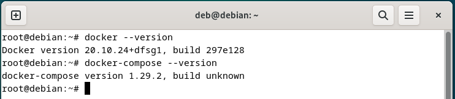

#### Создаем конфигурационный файл Docker с альтернативными репозиториями

Файл daemon.json содержит конфигурацию Docker-демона. Mirror-репозитории ускоряют загрузку образов, предоставляя географически близкие копии Docker Hub.

```
sudo tee /etc/docker/daemon.json << 'EOF'
{
  "registry-mirrors": [
    "https://mirror.gcr.io",
    "https://daocloud.io",
    "https://c.163.com/",
    "https://registry.docker-cn.com"
  ]
}
EOF
```
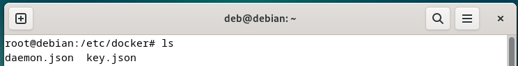

#### Перезапускаем Docker для применения изменений

Перезапуск необходим для применения изменений в конфигурации демона.

```
sudo systemctl restart docker
```

#### Переходим в домашнюю директорию и создаем папку для проекта

Создание отдельной директории помогает организовать проект и избежать конфликтов файлов.

```
mkdir ~/custom-nginx
cd ~/custom-nginx
```

#### Создаем Dockerfile - инструкцию для сборки образа

Dockerfile содержит две ключевые инструкции:

    FROM nginx:1.21.1 — указывает базовый образ для сборки

    COPY index.html /usr/share/nginx/html/index.html — копирует нашу HTML-страницу в стандартное расположение nginx

```
cat > Dockerfile << 'EOF'
FROM nginx:1.21.1
COPY index.html /usr/share/nginx/html/index.html
EOF
```

#### Создаем кастомную HTML-страницу

Это простая HTML-страница, которая будет отображаться вместо стандартной страницы nginx.

```
cat > index.html << 'EOF'
<html>
<head>
Hey, ZGU!
</head>
<body>
<p>I will be IT Engineer!</p>
</body>
</html>
EOF
```


#### Проверяем созданные файлы

Визуальная проверка файлов подтверждает их корректное создание и содержимое.

```
ls
cat Dockerfile
cat index.html
```
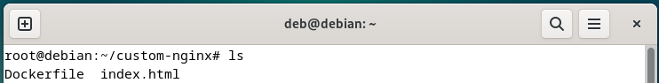

#### Собираем образ с тегом kreker101/custom-nginx:1.0.0

Команда docker build выполняет сборку образа:

    -t kreker101/custom-nginx:1.0.0 — задает имя и тег образа (формат: username/repository:tag)

    . — указывает текущую директорию как контекст сборки (где искать Dockerfile)

Процесс сборки включает:

    Скачивание базового образа nginx:1.21.1 (если отсутствует локально)

    Создание временного контейнера

    Копирование index.html в контейнер

    Сохранение изменений как нового образа

```
docker build -t kreker101/custom-nginx:1.0.0 .
```
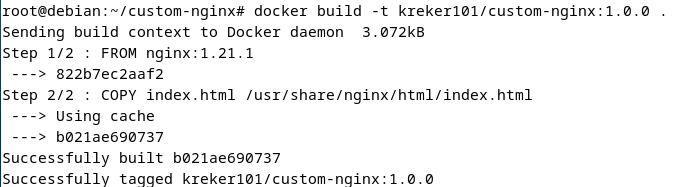


#### Проверяем, что образ создался

Фильтрация списка образов позволяет убедиться, что наш образ создан успешно.

```
docker images | grep kreker
```

#### Авторизуемся в Docker Hub (нужен аккаунт на hub.docker.com)

Docker Hub — это облачный реестр образов Docker. Аутентификация требуется для загрузки образов в публичные или приватные репозитории.

```
docker login
```

#### Загружаем образ в публичный репозиторий

Команда docker push загружает образ в Docker Hub.

```
docker push kreker101/custom-nginx:1.0.0
```

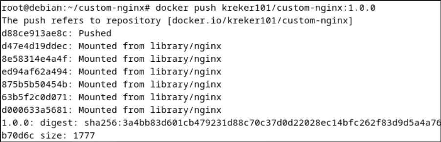

## Задание 2: Запуск контейнера
#### Запуск контейнера с именем "Kreker-custom-nginx-t2"

Теоретическое обоснование

Контейнер — это запущенный экземпляр образа. В отличие от образа (который статичен), контейнер динамичен — он может быть запущен, остановлен, перезапущен. Docker предоставляет изоляцию на уровне процесса, но использует ядро хостовой ОС, что делает контейнеры легковесными по сравнению с виртуальными машинами.

Проброс портов — это механизм, позволяющий направлять сетевой трафик с порта хоста в порт контейнера, делая сервис внутри контейнера доступным извне.

```
 -d: запуск в фоновом режиме 
 --name: задаем имя контейнера 
 -p 127.0.0.1:8080:80: пробрасываем порт 80 контейнера на порт 8080 хоста, только на localhost
docker run -d \
  --name "Kreker-custom-nginx-t2" \
  -p 127.0.0.1:8080:80 \
  kreker101/custom-nginx:1.0.0
```

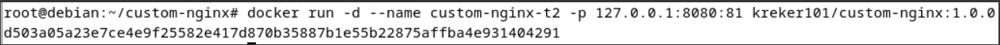

#### Проверяем, что контейнер запустился

Команда docker ps показывает все запущенные контейнеры с их статусами, именами, портами и другой информацией.

```
docker ps
```

### Переименование контейнера
#### Переименовываем контейнер в "custom-nginx-t2" согласно заданию

Переименование контейнера упрощает дальнейшую работу с ним, особенно когда имя должно соответствовать требованиям задания.

```
docker rename "Kreker-custom-nginx-t2" custom-nginx-t2
```

###  Выполнение комплексной команды из задания
#### Команда выполняет несколько действий последовательно:
 
Эта последовательность команд выполняет комплексную проверку:

    date +"%d-%m-%Y %T.%N %Z" — точное время выполнения

    sleep 0.150 — пауза для исключения временных факторов

    docker ps — проверка статуса контейнера

    ss -tlpn | grep 127.0.0.1:8080 — проверка, что порт 8080 слушается

    docker logs custom-nginx-t2 -n1 — последняя строка логов nginx

    docker exec -it custom-nginx-t2 base64 /usr/share/nginx/html/index.html — проверка содержимого файла через кодирование base64

```
date +"%d-%m-%Y %T.%N %Z" ; sleep 0.150 ; docker ps ; ss -tlpn | grep 127.0.0.1:8080 ; docker logs custom-nginx-t2 -n1 ; docker exec -it custom-nginx-t2 base64 /usr/share/nginx/html/index.html
```

#### Проверка доступности веб-страницы

Команда curl отправляет HTTP-запрос к нашему веб-серверу и возвращает HTML-код страницы, подтверждая работоспособность.

```
curl http://127.0.0.1:8080
```

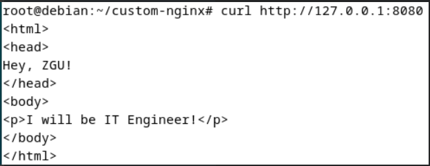

## Задание 3: Работа с контейнером

Теоретическое обоснование

Управление запущенными контейнерами включает несколько аспектов:

    Мониторинг — просмотр логов, статуса контейнера

    Модификация — изменение конфигурации работающего контейнера

    Диагностика — выявление и решение проблем

    Управление жизненным циклом — остановка, перезапуск, удаление

Проблема Debian Buster — контейнеры, основанные на старых версиях ОС, могут иметь устаревшие репозитории, которые больше не поддерживаются.

#### Подключение к контейнеру и остановка

Команда docker attach подключает терминал к основному процессу контейнера (nginx). Нажатие Ctrl+C отправляет сигнал SIGINT процессу nginx, что приводит к его корректному завершению и остановке контейнера.

```
docker attach custom-nginx-t2
```
#### Нажатие Ctrl+C для остановки

#### Проверка статуса после остановки

Флаг -a показывает все контейнеры, включая остановленные. Контейнер имеет статус "Exited", что подтверждает его остановку.

```
docker ps -a
```

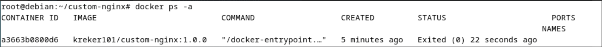

#### Перезапуск контейнера

Команда docker start перезапускает остановленный контейнер с сохранением всех изменений в его файловой системе (кроме тех, что находятся в смонтированных томах).

```
docker start custom-nginx-t2
docker ps
```
#### Решение проблемы с устаревшими репозиториями Debian Buster
```
docker exec -it custom-nginx-t2 bash
```

#### Внутри контейнера:

Debian достиг End of Life, и его стандартные репозитории перемещены в архив. Мы:

    Обновляем sources.list для использования архивных репозиториев

    Отключаем проверку срока действия метаданных репозиториев

    Обновляем список пакетов и устанавливаем текстовый редактор nano

```
cat > /etc/apt/sources.list << 'EOF'
deb http://archive.debian.org/debian/ buster main contrib non-free
deb http://archive.debian.org/debian-security/ buster/updates main contrib non-free
EOF

echo 'Acquire::Check-Valid-Until "false";' > /etc/apt/apt.conf.d/99archive
apt update
apt install nano -y
```

#### Изменение конфигурации nginx

Конфигурационный файл nginx определяет, на каких портах сервер принимает соединения. Изменение порта с 80 на 81 демонстрирует, как можно модифицировать сервисы внутри контейнера. Команда nginx -s reload перезагружает конфигурацию без остановки сервера.

```
nano /etc/nginx/conf.d/default.conf
```

#### Изменение "listen 80;" на "listen 81;"
```
nginx -s reload
```
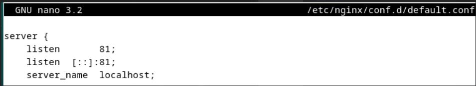

#### Проверка изменений внутри контейнера
```
curl http://127.0.0.1:80
curl http://127.0.0.1:81
exit
```
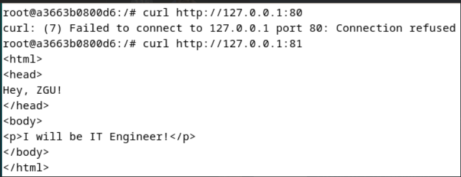

#### Проверка проблемы снаружи контейнера

Здесь выявляется ключевая проблема:

    ss -tlpn | grep 127.0.0.1:8080 — показывает, что порт 8080 на хосте слушается

    docker port custom-nginx-t2 — показывает, что порт 80 контейнера проброшен на порт 8080 хоста

    curl http://127.0.0.1:8080 — возвращает ошибку, так как nginx внутри контейнера теперь слушает порт 81, а не 80

Вывод: Изменение конфигурации внутри контейнера не изменяет настройки проброса портов Docker. Для исправления нужно либо изменить проброс портов, либо вернуть конфигурацию nginx к исходному состоянию.

```
ss -tlpn | grep 127.0.0.1:8080
docker port custom-nginx-t2
curl http://127.0.0.1:8080
```

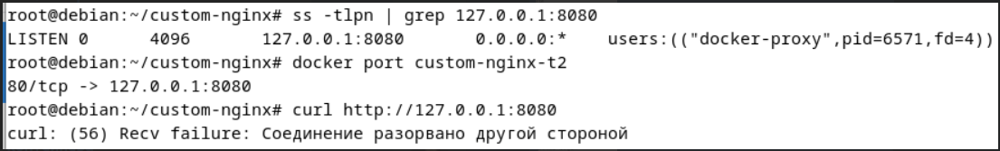

#### Удаление контейнера

Флаг -f (force) позволяет удалить контейнер даже если он запущен. Это демонстрирует различные подходы к управлению контейнерами: можно корректировать работающие контейнеры или удалять и создавать новые.

```
docker rm -f custom-nginx-t2
docker ps -a
```
## Задание 4: Работа с volumes

Теоретическое обоснование

Тома (Volumes) в Docker — это механизм для сохранения данных, созданных и используемых контейнерами. Тома решают несколько проблем:

    Сохранение данных — данные не теряются при удалении контейнера

    Обмен данными — несколько контейнеров могут использовать одни и те же данные

    Резервное копирование — тома можно легко архивировать и восстанавливать

Тома бывают трех типов:

    Host volumes — монтирование конкретной директории хоста в контейнер

    Anonymous volumes — автоматически создаваемые тома

    Named volumes — именованные тома, управляемые Docker

#### Создание рабочей директории

Создание отдельной директории для эксперимента с томами.

```
mkdir task4 && cd task4
pwd
```

#### Запуск контейнеров CentOS и Debian с общим томом

Параметр -v $(pwd):/data монтирует текущую директорию хоста ($(pwd)) в директорию /data внутри контейнера. tail -f /dev/null — команда, которая держит контейнер запущенным, ничего не делая.

```
docker run -d --name centos-container -v $(pwd):/data centos:7 tail -f /dev/null
docker run -d --name debian-container -v $(pwd):/data debian:11 tail -f /dev/null
docker ps
```
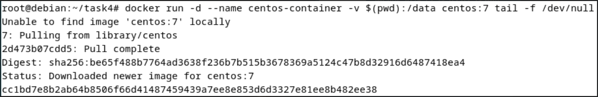

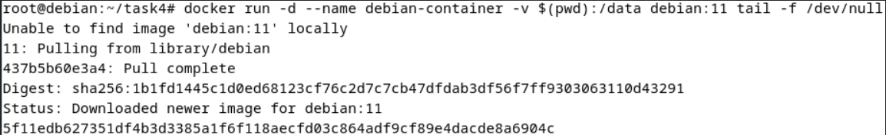

#### Создание файла в контейнере CentOS

Создание файла в смонтированном томе из контейнера CentOS. Файл сразу появляется на хосте, так как том общий

```
docker exec centos-container bash -c "echo 'Hello from CentOS' > /data/centos-file.txt"
ls -la
cat centos-file.txt
```

#### Создание файла на хосте

Создание файла непосредственно на хосте демонстрирует двустороннюю синхронизацию.

```
echo "Hello from Host" > host-file.txt
ls -la
```

#### Проверка файлов в контейнере Debian

Проверка показывает, что оба контейнера видят одни и те же файлы в смонтированном томе, демонстрируя эффективный обмен данными.

```
docker exec debian-container ls -la /data/
docker exec debian-container cat /data/centos-file.txt
docker exec debian-container cat /data/host-file.txt
```
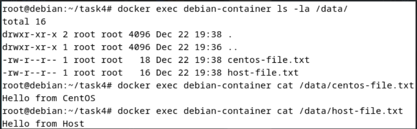

## Задание 5: Docker Compose

Теоретическое обоснование

Docker Compose — это инструмент для определения и запуска многоконтейнерных приложений Docker. В отличие от отдельных команд docker run, Docker Compose позволяет описать все сервисы, сети и тома в одном YAML-файле и управлять ими как единым приложением.

Ключевые преимущества Docker Compose:

    Упрощение — одна команда вместо множества docker run

    Воспроизводимость — одинаковое окружение на всех машинах

    Управление зависимостями — автоматический порядок запуска сервисов

    Масштабируемость — легкое добавление новых экземпляров сервисов

Portainer — веб-интерфейс для управления Docker, который упрощает визуализацию и управление контейнерами, образами, томами и сетями.

Docker Registry — хранилище Docker-образов. Локальный registry позволяет хранить образы внутри сети без необходимости загружать их в публичный Docker Hub.

#### Создание директории и файлов компоуза

Создаются два файла конфигурации:

    compose.yaml — содержит сервис Portainer с доступом к Docker socket

    docker-compose.yaml — содержит сервис Docker Registry на порту 5000

```
mkdir -p /tmp/ZGU/docker/task
cd /tmp/ZGU/docker/task

cat > compose.yaml << 'EOF'
version: "3"
services:
  portainer:
    network_mode: host
    image: portainer/portainer-ce:latest
    volumes:
      - /var/run/docker.sock:/var/run/docker.sock
EOF

cat > docker-compose.yaml << 'EOF'
version: "3"
services:
  registry:
    image: registry:2
    ports:
      - "5000:5000"
EOF

ls -la
cat compose.yaml
cat docker-compose.yaml
```

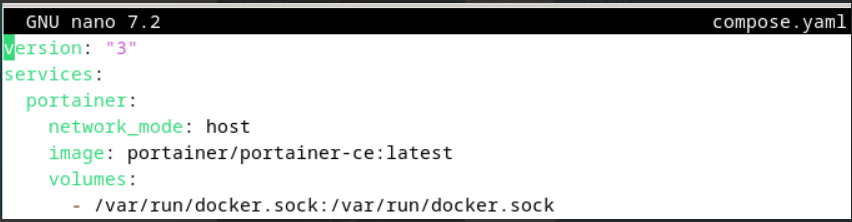

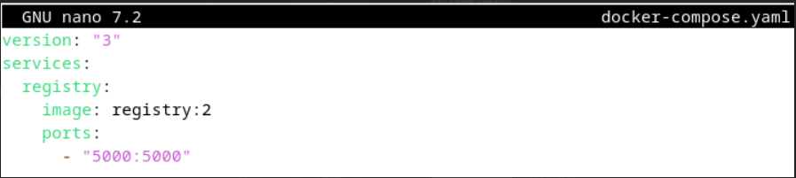

#### Первый запуск и получение предупреждений

Docker Compose по умолчанию использует файл compose.yaml. Предупреждения указывают на:

    Наличие нескольких файлов конфигурации

    Устаревший атрибут version (в новых версиях Docker Compose он игнорируется)

```
docker compose up -d
```
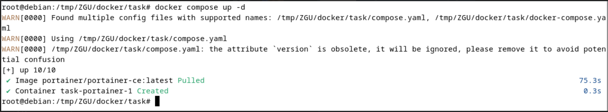

#### Объединение конфигураций через include

Директива include позволяет включать другие YAML-файлы, что полезно для модульной организации конфигурации.

```
cat > compose.yaml << 'EOF'
version: "3"
include:
  - docker-compose.yaml

services:
  portainer:
    network_mode: host
    image: portainer/portainer-ce:latest
    volumes:
      - /var/run/docker.sock:/var/run/docker.sock
EOF

cat compose.yaml
```

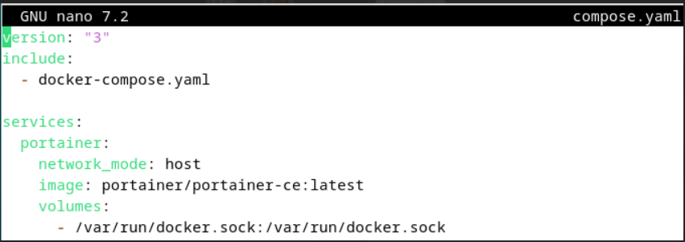

#### Настройка Portainer через веб-интерфейс

Portainer предоставляет графический интерфейс для управления Docker, что упрощает операции для пользователей, не знакомых с командной строкой.

```
Открыть в браузере: http://127.0.0.1:9000
 Создать администратора: логин admin, пароль [ваш пароль]

 Развертывание стека через Portainer
 В Portainer: Stacks → Add stack
 Имя: custom-nginx-stack
 Web editor:
 version: '3'
 services:
   nginx:
     image: 127.0.0.1:5000/custom-nginx
     ports:
       - "9090:80"
 Deploy the stack
```
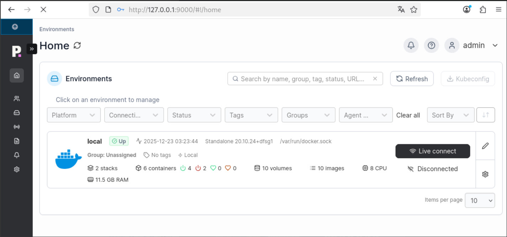

#### Проверка работы стека

Проверка подтверждает успешное развертывание стека через Portainer.

```
curl http://127.0.0.1:9090
docker ps | grep nginx
```

#### Анализ warning при удалении compose.yaml

После удаления compose.yaml остается только docker-compose.yaml, что приводит к предупреждениям:

    version is obsolete — атрибут version устарел и игнорируется

    Found orphan containers — обнаружены контейнеры, не описанные в текущем файле

Orphan containers — это контейнеры, созданные из предыдущих конфигураций, но не упомянутые в текущем compose-файле. Они могут занимать ресурсы и вызывать конфликты.

```
rm compose.yaml
docker compose up -d
```
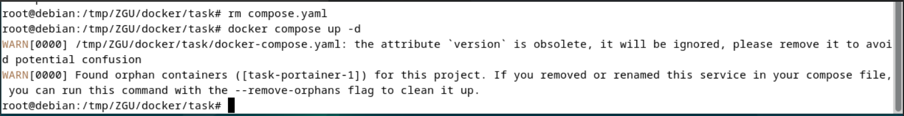

Объяснение warning:

    version is obsolete: атрибут version устарел в новых версиях Docker Compose

    Found orphan containers: обнаружены контейнеры, созданные из старого файла конфигурации

    
    # Выполнение предложенного действия

Флаг --remove-orphans удаляет контейнеры, которые больше не описаны в compose-файле. Команда docker compose down останавливает и удаляет все контейнеры, сети и тома, созданные docker compose up.

```
docker compose up -d --remove-orphans
docker compose down
docker ps -a
```

Заключение

В ходе лабораторной работы был пройден полный цикл работы с Docker — от установки и создания кастомных образов до оркестрации многоконтейнерных приложений через Docker Compose и Portainer.

Дата выполнения: Декабрь 2025